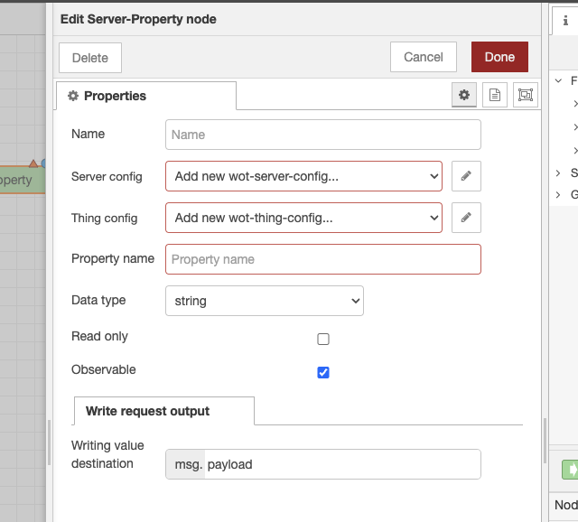
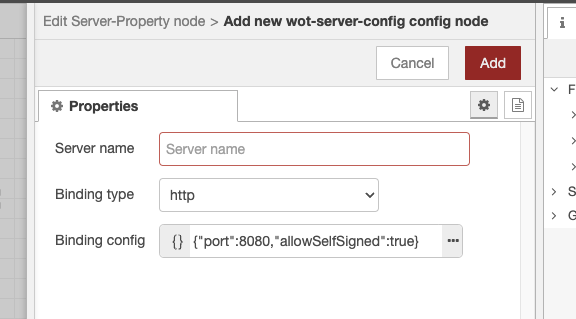
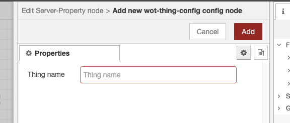
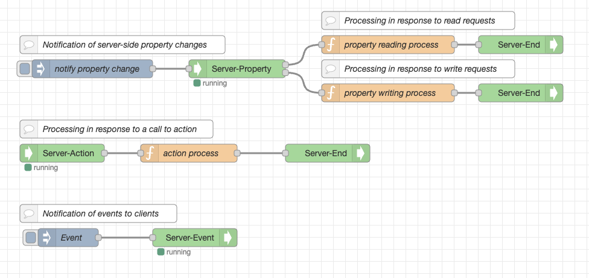
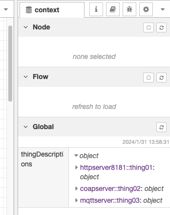

# node-red-contrib-wot

A [Node-RED](https://nodered.org/) package of nodes for the [Web of Things](https://www.w3.org/WoT/).

Can be installed from the Node-RED palette manager directly or via npm (see [the npm package](https://www.npmjs.com/package/node-red-contrib-web-of-things)).
The package provides nodes that can communicate with any HTTP/HTTPS, WebSocket, CoAP/CoAPS, MQTT, OPC UA and Modbus device based on its [W3C WoT Thing Description](https://www.w3.org/TR/wot-thing-description/).

The package is build upon [node-wot](https://github.com/eclipse/thingweb.node-wot) runtime environment.

## Provided Nodes

After installation the package adds 8 different nodes at the Node-RED palette, all together scoped under "Web of Things" title.
Those nodes are as follows and needed to interact with different interaction affordances of a Thing:

1) Read Property node;
2) Write Property node;
3) Invoke Action node;
4) Subscribe Event node;
5) Server-End node;
6) Server-property node;
7) Server-Action node;
8) Server-Event node.

## Getting Started

### Consume Things

In order to consume a Thing and interact with it, drag and drop one of the interaction nodes to a flow.
Then double click on that node.
Inside the opened window click the pencil icon next to "Add new consumed-thing..." dropdown.

A new window will appear.

Now either copy-paste/type in a Thing Description inside the TD JSON box or fetch a Thing Description from a URL.
**Tip:** In case you choose the first option, click on the three dots to expand the JSON editor.

After you click "Process"/"Fetch", all protocol bindings supported by the Thing will be enabled (except they are not supported by this package).
Now you can leave only the bindings you need, and disable the others.
Or you can leave them all as they are.
Anyway, this can be changed at any time.

If a Thing needs basic authentication (i.e. using username and password) for any of its interaction affordances, you can enable that in the respective checkbox.
**Note:** Only basic type of authentication is currently supported by this package.
If you enable security, the nodes will automatically infer whether to use authentication for this particular affordance or not based on the provided Thing Description.

Finally, click on the red "Add" button on the top right corner.

Now, for all WoT nodes you add to a flow, you will see all the respective interaction affordances populated from the Thing Description.

You can also add more Things and choose a particular one for any node you add.

In order to see a fetched property value you can wire it with the "debug" node of Node-RED, and see all the values inside the "Debug messages" tab of Node-RED.
In order to write to a property, wire an "inject" node with the "Write Property" node.
In the "inject" node, select JSON format as payload and plug in your value.

To send an input for an action you can also wire it with the "inject" node as explained above.
**Tip:** In order to invoke an action that does not require any input, wire it with an empty "inject" node.

Properties and Actions also support uriVariables.
They can be specified inside "Read Property"/"Write Property"/"Invoke Action" node properties.

Subscribing to an event is pretty much the same as reading a property.

Overall, a basic flow may look like this.

### Expose Things

To expose a Thing, firstly, drag & drop one of the nodes belonging to the Thing, either Property(Server-Property), Action(Server-Action), or Event(Server-Event) to the canvas. 

When you double-click on that node, a property screen appears.

On the properties screen, the `Server config` and `Thing config` must be configured. The roles of each configs are as follows:

* Server config: Set up the communication method between the client and the Thing.
* Thing config: Set the attributes of the Thing such as the Thing name.

By performing `Server config` and `Thing config` in the Server-Property, Server-Action, Server-Event nodes, you determine how to publish properties, actions, and events.

If you create a new server config on the properties screen, the following screen will appear.

Perform the following settings:

* Server name: Specify the server name.
* Binding type: Specify the communication method between the server and the client.
* Binding config: Perform settings according to the type of binding.

If you create a new thing config on the properties screen, the following screen will appear.

Specify the Thing name. The Thing name will be included in the Thing Description.

Server config and Thing config can be shared across multiple Server-Property, Server-Action, Server-Event nodes. By sharing configs, you can publish one or more properties, actions, and events to the client as a single Thing.

In addition to server config and Thing config, there are necessary settings for each Server-Property, Server-Action, Server-Event node. For the settings of each node, refer to the node help. Help can be viewed on the Node-RED editor's Help tab.

The Server-End node represents the end of a flow executed by a client request.
Flows connected to the two output terminals of the Server-Property node (read/write requests) and the output terminal of the Server-Action node must end with the Server-End node.

Here's an example of a flow:

The Thing Description required when the client uses a Thing is set in the thingDescriptions object of the global context. The member name is `<server name>::<Thing name>`.
If you want to check the Thing Description, open the Context Data tab of Node-RED editor and press the refresh icon of the Global context to display it.

Currently, the supported binding types are http, coap, and mqtt. As shown in the table below, each of these types of bindings has its own available/unavailable functions. Available functions are denoted by `✓` and unavailable functions are denoted by `-`.

| |http|coap|mqtt|
| :---: | :--- | :--- | :--- |
|read property|✓|✓|-|
|observe property|✓ *1|-|✓|
|write property|✓|✓|✓|
|invoke action|✓|✓|-|
|subscribe event|✓ *1|-|✓|

*1: After the connection with the server times out after 1 hour, it is not reconnected
