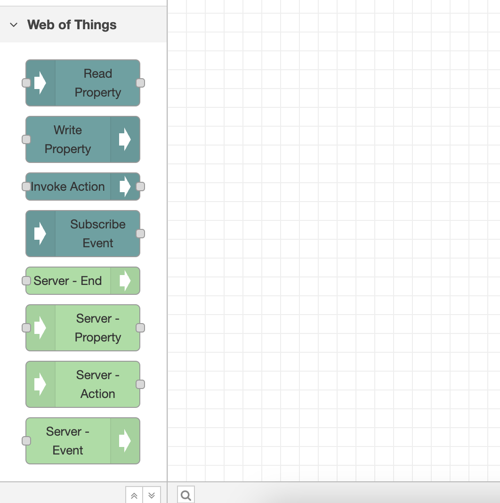
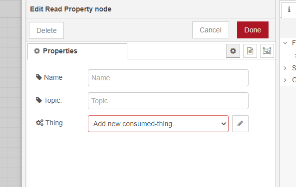
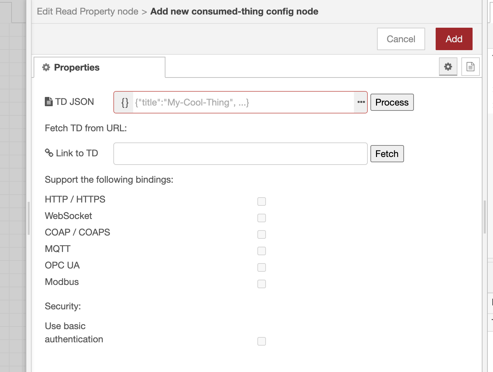

# node-red-contrib-wot

A [Node-RED](https://nodered.org/) package of nodes for the [Web of Things](https://www.w3.org/WoT/).

Can be installed from the Node-RED palette manager directly or via npm (see [the npm package](https://www.npmjs.com/package/node-red-contrib-web-of-things)).
The package provides nodes that can communicate with any HTTP/HTTPS, CoAP/CoAPS, MQTT, OPC UA and Modbus device based on its [W3C WoT Thing Description](https://www.w3.org/TR/wot-thing-description/).

The package is build upon [node-wot](https://github.com/eclipse/thingweb.node-wot) runtime environment.

## Provided Nodes

After installation the package adds 4 different nodes at the Node-RED palette, all together scoped under "Web of Things" title.
Those nodes are as follows and needed to interact with different interaction affordances of a Thing:

1) Read Property node;
2) Write Property node;
3) Invoke Action node;
4) Subscribe Event node.

## Getting Started

### Consume Things

In order to consume a Thing and interact with it, drag and drop one of the interaction nodes to a flow.
Then double click on that node.
Inside the opened window click the pencil icon next to "Add new consumed-thing..." dropdown.

A new window will appear.

Now either copy-paste/type in a Thing Description inside the TD JSON box or fetch a Thing Description from a URL.
**Tip:** In case you choose the first option, click on the three dots to expand the JSON editor.

After you click "Process"/"Fetch", all protocol bindings supported by the Thing will be enabled (except they are not supported by this package).
Now you can leave only the bindings you need, and disable the others.
Or you can leave them all as they are.
Anyway, this can be changed at any time.

Finally, click on red "Add" button on top right corner.

Now, for all WoT nodes you add to a flow, you will see all the possible interaction affordances populated from the Thing Description.

You can also add more Things and choose a particular one for any node you add.

In order to see a fetched property value you can wire it with the "debug" node of Node-RED, and see all the values inside the "Debug messages" tab of Node-RED.
In order to write to a property, wire an "inject" node with the "Write Property" node.
In the "inject" node, select JSON format as payload and plug in your value.

To send an input for an action you can also wire it with the "inject" node as explained above.
**Tip:** In order to invoke an action that does not require any input, wire it with an empty "inject" node.

Properties and Actions also support uriVariables.
They can be specified inside "Read Property"/"Write Property"/"Invoke Action" node properties.

Subscribing to an event is pretty much the same as reading a property.

Overall, a basic flow may look like this.

### Expose Things
Exposing Things is currently not available within this package but might be added later.
